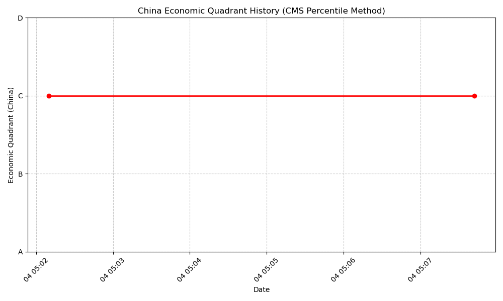
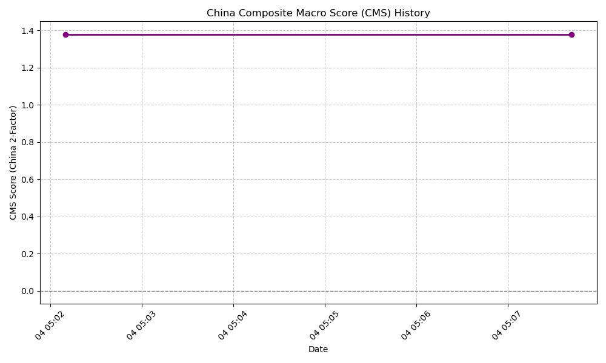

# China Market Analysis Report

Report generated on: 2025-04-04 05:10:13

## Contents

1. [China Economic Conditions Summary](china_economic_summary.md)
2. [China Stock Analysis Summary](china_stock_summary.md)

Current China Economic Quadrant: **C** (Quadrant C (CMS Pctl 69.4%): Above average macro momentum.)

**CMS (2-Factor)**: 1.38 (69.4% percentile vs 5yr)

### Visualizations

